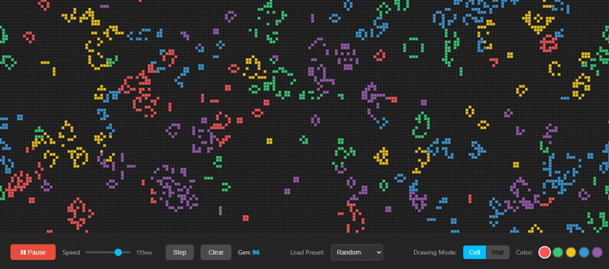

# Game of Life++: An Interactive Generative Art Sandbox

### [➡️ Click here to view the Live Demo ⬅️](https://voice-less.github.io/game-of-life-plus-plus/)

This project is an enhanced and interactive web-based implementation of John Conway's famous "Game of Life". It transforms the classic zero-player simulation into a creative sandbox where users can design, observe, and experiment with complex cellular automata.

The core of the project is built with **pure, dependency-free JavaScript** and leverages the **HTML5 Canvas API** for high-performance rendering of the grid, ensuring a smooth experience even with thousands of cells.

---

## ✨ Core Features

*   **🎨 Creative Sandbox:** Don't just watch—create! **Paint** custom patterns directly onto the grid using your mouse. Add **immortal "wall" cells** to create obstacles, channels, and contained experiments.

*   **🌍 Competing Ecosystem:** The unique twist on the classic rules. Instead of one type of cell, you can paint with multiple colors. When a new cell is born, its color is determined by the **dominant color of its three parents**, leading to fascinating patterns of territorial competition and evolution.

*   **📚 Classic Pattern Library:** Instantly load famous and complex patterns from the history of Game of Life, including the **Glider**, the **Pulsar**, and the intricate **Gosper's Glider Gun**.

*   **🔬 Full Interactive Control:**
    *   **Play, Pause, and Step-by-Step** simulation control.
    *   **Dynamic Speed Slider** to adjust the simulation rate in real-time.
    *   **Zoom and Pan** the infinite canvas to inspect detailed interactions or view massive patterns.
    *   **Keyboard Shortcuts** for all primary actions (`Space`, `S`, `C`, `B`).

---

## 🛠️ Tech Stack

*   **HTML5:** For the core structure.
*   **CSS3:** For modern, responsive styling of the user interface.
*   **Vanilla JavaScript (ES6+):** For all simulation logic, state management, and DOM interaction. No frameworks or external libraries were used.
*   **HTML5 Canvas API:** For high-performance, real-time rendering of the cell grid.

---

## Acknowledgments

This project is a tribute to the brilliant work of the late mathematician **John Horton Conway** and is inspired by the endless creativity of the cellular automata community.